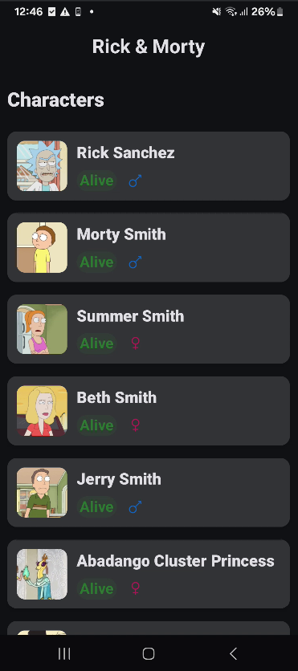

# Rick & Morty Challenge app

# 📱Overview

This project implements a character list screen consuming the Rick & Morty public API.
The goal was to deliver a clean, maintainable, and scalable solution, prioritizing architectural clarity and good engineering practices over feature completeness.
---

# 🧱 Architecture

The project follows a MVVM + Clean Architecture approach:

* UI (Compose)
* Responsible only for rendering state and handling user interactions.
* ViewModel
* Manages UI state using StateFlow, handles user actions, and coordinates data flow.
* Domain Layer (UseCases)
* Data Layer
* Repository pattern
* Remote source (API)
* Local source (Room database)

---

## Screenshots

| Character Screen | Detail Screen |
|------------------|---------------|
| | |
---
# 🔄 State Management

UI state is modeled using a single immutable state object:

* data: list of characters
* isLoading: initial loading
* isLoadingMore: pagination loading
* error: error message

This approach allows:

* Smooth UI updates without flickering
* Pagination support
* Better scalability compared to sealed-only states

---

# 🌐 Networking
Implemented using Retrofit
All API calls are wrapped with a safeApiCall helper returning a Resource type:
* Success
* Error (mapped to domain-level errors)

---

# 💾 Data Persistence

Room database was added as a local source of truth:

* API responses are cached locally
* Repository follows a simple strategy:
  * On success → cache data
  * On failure → fallback to local data

This enables:

*   Basic offline support
*   Improved resilience

---

# 📜 Pagination

Basic pagination support was implemented:

* Tracks current page in ViewModel
* Appends new data instead of replacing existing list
* Uses scroll position detection to trigger loading

Concurrency is handled by:

* State guards (isLoadingMore)
* Preventing duplicate requests

---

# 🖼️ Image Loading
Implemented using Coil (AsyncImage)
* Includes:
    * Placeholder
    * Error fallback
    * Size optimization to avoid unnecessary memory usage
---

# 🎨 UI

Built with Jetpack Compose, focusing on:

* Reusable components
* Clear visual hierarchy
* Consistent spacing and layout
* Sticky header in list
* Explicit UI states (loading, error, success)
---

# ⚠️ Error Handling
* Network errors are mapped to domain-level errors
* UI displays a simple error state with retry capability
---

# 🤖 Use of AI

AI tools (ChatGPT) were used as a support tool, mainly for:

* Clarifying architectural approaches (state modeling, pagination, Room usage) to support final decision-making
* Reviewing UI/UX improvements
* Refining edge cases (pagination triggers, flicker issues)
* Assisting with final refinements and polishing (UI adjustments, minor improvements, and finishing details)

All final decisions, implementation, and adaptations were made manually.
---

# 🚧 What’s Missing / Trade-offs

Given the time constraints, the following aspects were simplified or left out:

* No unit/UI tests implemented
* No advanced pagination (e.g., Paging 3)
* No full offline-first synchronization strategy
* Error messages are basic (could be more user-friendly)
* No animations or transitions between screens
---

# 🚀 Future Improvements

With more time, the following improvements would be considered:

- [x] Add unit tests and
- [ ] Add UI tests
- [ ] Improve offline-first strategy (single source of truth with Flow)
- [ ] Add loading skeletons instead of simple indicators
- [ ] Implement Paging 3 for robust pagination
- [ ] Enhance error handling with better user feedback
